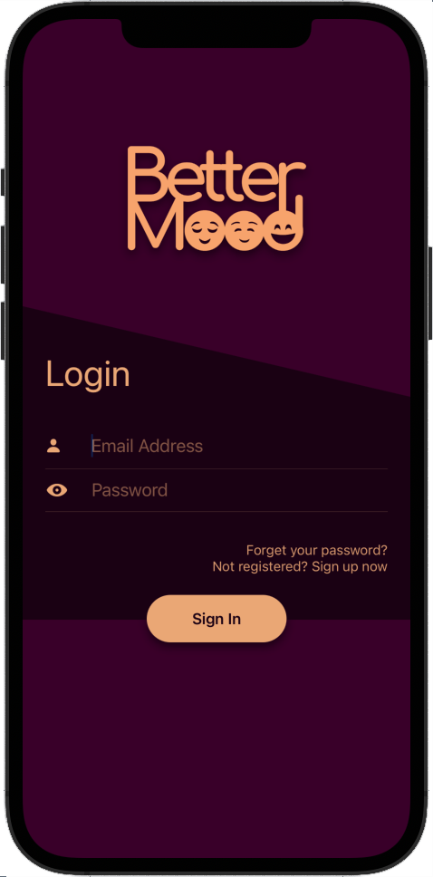
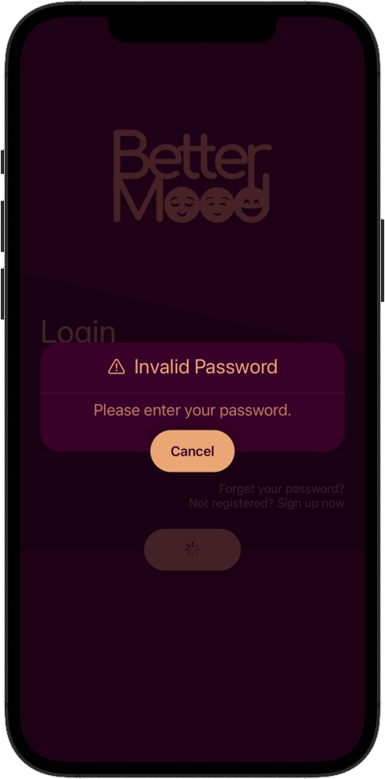
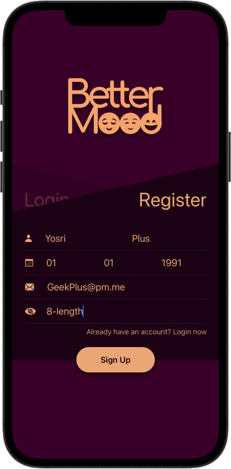

<div align="center">
    
</div>

---

# Introduction
> BetterMood is an iOS app that uses Tensorflow to recognize user’s emotions, convert it into categories then send via our api along with the user’s date of birth and name, to end up with a emotion analyse and horoscope prediction.

> All generated information will be based on the user's horoscope sign as I believe in astrology, and the actual user face signs.

# User Experience

## Authentication Page

<div align="center">
    <h3>Login</h3>
    
    
    
    <h3>Reset Password</h3>
    
    
    <h3>Register</h3>
    
    
    
</div>

## Home Page

> We provide Emotion recognition that return BarChart Contains:
> Neutral, Happy, Angry, Sad, Surprise, Fear, Disgust
> Also Daily horoscope based on daily prediction, contains:
> Today's, Romance, Money, Career, Travel, Home

<div align="center">
    <h3>Parrot Face</h3>
    
    &nbsp;
    
    <h3>Einstein 3D Face</h3>
    
    &nbsp;
    
    <h3>Horoscope</h3>
    
    &nbsp;
    
</div>

## Instruction

> Backend is fully written in Python (Flask)

```Please edit 'app.config['MONGO_URI'] = "mongodb+srv://MONGO_DATA_BASE_URL"'```

```
$ git clone https://github.com/YosriGFX/BetterMood.git
$ cd BetterMood
$ cd backend
$ pip install -r requirements.txt
$ python3 app.py
```

> Frontend is fully written in Swift

```Please edit 'let domain = "URL_API"' with your end_point```

```
$ cd ..
$ cd iOS_app
$ pod install
$ open BetterMood.xcworkspace
```

---

```Proudly written by Yosri Ghorbel```


> Copyright © 2021 [Yosri.dev](https://Yosri.dev). All rights reserved.
