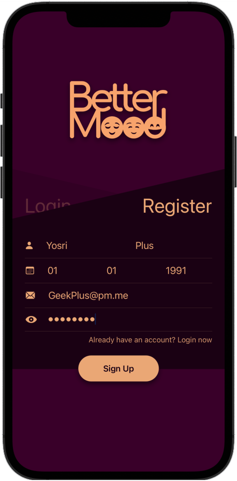

<div align="center">
    
</div>

---

## Introduction
> BetterMood is an iOS app that implements ARKIT to recognize user’s emotions, convert it into categories then send to our api along with the user’s date of birth and name, to end up with a motivational paragraph that makes the user feel better.

> Also, the App will show some suggested youtube music videos titles that match the user's feelings.

> All generated information will be based on the user's horoscope sign as I believe in astrology, and the actual user face signs.

## User Experience

### Authentication Page

<div align="left">
    
    
</div>

---

```Proudly written by Yosri Ghorbel```


> Copyright © 2021 [Yosri.dev](https://Yosri.dev). All rights reserved.
